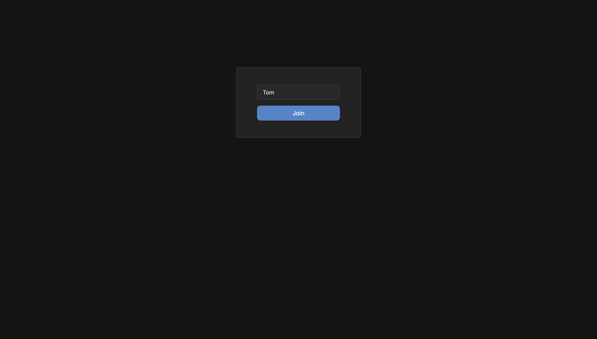
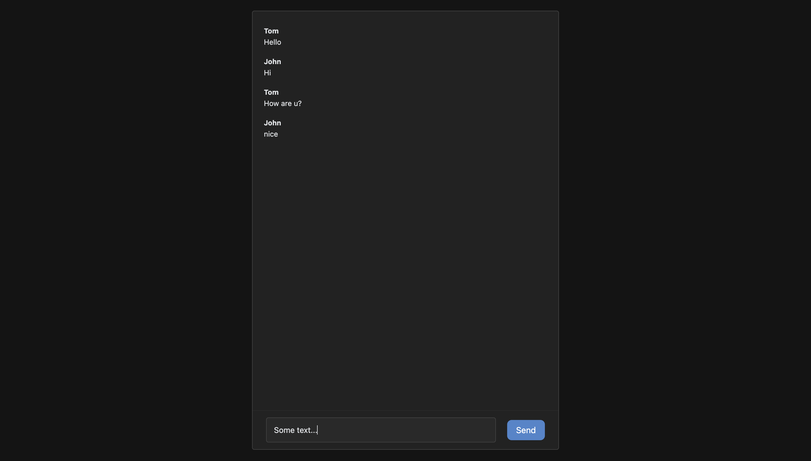

# chat

#### It is simple chat using websockets. There is <a href="https://github.com/vy-levyy/chat-backend" target="_blank">backend</a>.

The following base technologies are used here:
- typescript;
- react hooks;
- redux-toolkit (including RTK Query);
- styled-components;
- websockets;
- webpack.

